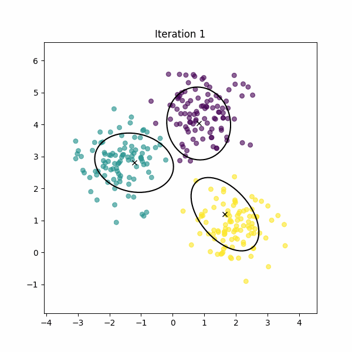
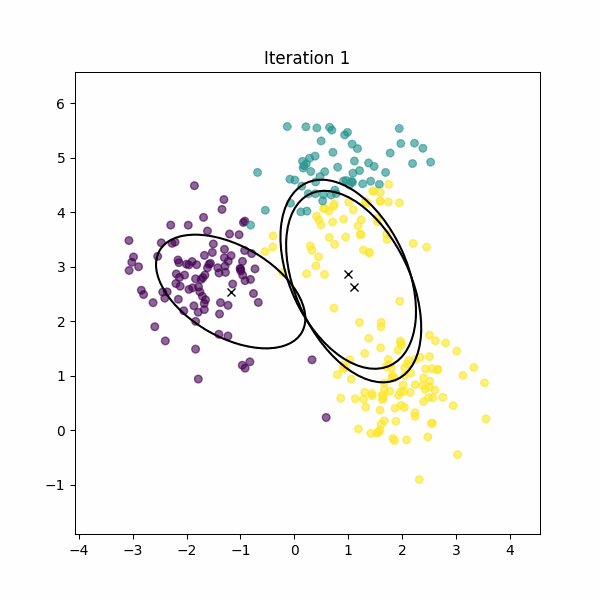

# EM for Gaussian Mixture Models: Initialization Study

This repository contains an implementation of the Expectation-Maximization (EM) algorithm for Gaussian Mixture Models (GMMs), developed from scratch using Python and NumPy. The project investigates how the choice of initialization—random or KMeans-based—affects the performance of EM in terms of convergence and clustering quality.

## Objectives

- Implement the EM algorithm for GMMs without using high-level machine learning libraries.
- Compare random and KMeans initialization strategies.
- Evaluate performance on synthetic data and real biomedical data (Breast Cancer Wisconsin Diagnostic dataset).
- Measure clustering quality using Adjusted Rand Index (ARI) and analyze log-likelihood evolution.
- Assess the role of feature selection in improving numerical stability in high-dimensional data.

## Repository Structure

```
em-gmm-project/
│
├── emgmm/                      # Source code as a Python package
│   ├── __init__.py
│   ├── gmm.py                  # EM algorithm implementation
│   └── utils.py                # Initialization and utility functions
│
├── notebooks/                 
│   ├── 01_em_gmm_demo.ipynb            # Synthetic data experiments
│   ├── 02_real_data_gmm.ipynb          # Application on real data
│   ├── 03_highdim_gmm.ipynb            # Experiments with full feature set
│
├── figures/                    # Plots and visualizations
│
├── report/                     # LaTeX report and sections
│   ├── main.tex
│   └── sections/
│
├── requirements.txt            # Project dependencies
├── setup.py                    # Package configuration
└── README.md
```

## Installation

To install the project as a local package in editable mode:

```bash
git clone https://github.com/your-username/em-gmm-project.git
cd em-gmm-project
pip install -e .
```

## Usage Example

Once installed, you can use the GMM implementation from any script or notebook:

```python
from emgmm import GMM
from sklearn.datasets import make_blobs

# Generate synthetic data
X, _ = make_blobs(n_samples=300, centers=3, cluster_std=1.0, random_state=42)

# Fit GMM
model = GMM(n_components=3, init_method="kmeans")
model.fit(X)

# Predict clusters
labels = model.predict(X)
```

For detailed usage, refer to the notebooks in the `notebooks/` folder.

## Notebooks

- `01_em_gmm_demo.ipynb`: Basic EM implementation on synthetic data
- `02_real_data_gmm.ipynb`: Application on Breast Cancer dataset
- `03_highdim_gmm.ipynb`: Using full 30-dimensional dataset

## Dependencies

- Python ≥ 3.8
- NumPy
- Pandas
- Matplotlib
- Scikit-learn
- Jupyter

Install all dependencies with:

```bash
pip install -r requirements.txt
```

## Visualizing EM Convergence

## Visualizing EM Convergence

Below are two examples of EM convergence on synthetic data:

**KMeans Initialization**  


**Random Initialization**  

